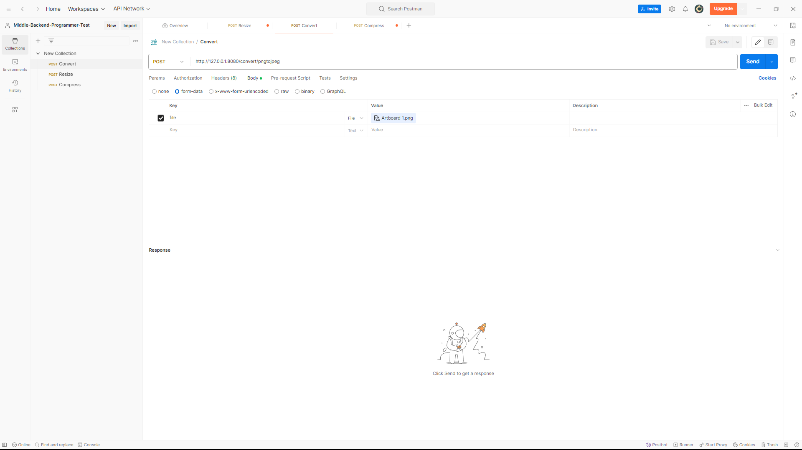
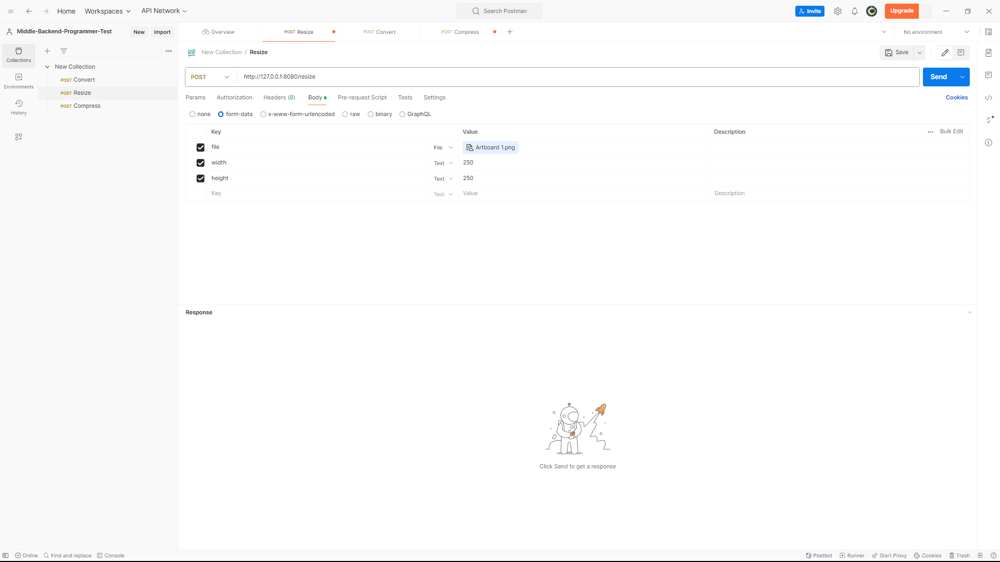

# Middle-Backend-Programmer-Test

This is a simple Go application for image processing, including functionalities like compressing images, converting PNG to JPEG, and resizing images.

### Dependencies

* Go (v1.16 or higher)
* GitHub.com/disintegration/imaging

### Installation
1. Ensure you have Go installed on your system. You can download and install it from the official [Go website](https://go.dev/).
2. Clone this repository to your local machine:
    ```bash
   git clone https://github.com/ElvinKukuhN/Middle-Backend-Programmer-Test.git

3. Change directory to the project folder:
    ```bash
   cd Middle-Backend-Programmer-Test
4. Install the required dependencies using `go get`:
    ```bash
   go get github.com/disintegration/imaging

### Setup and Running
1. Navigate to the project directory in your terminal.
2. Run the application using the `go run` command:
    ```bash
   go run main.go
3. The server should now be running locally. You can access the endpoints at the following URLs:

   * Convert PNG to JPEG: http://localhost:8080/convert/pngtojpeg
   * Resize Image: http://localhost:8080/resize
   * Compress Image: http://localhost:8080/compress    

### Postman Testing
Here are the steps to set up requests in Postman to test each implemented endpoint:

#### Convert PNG to JPEG
* Method: POST
* URL: http://localhost:8080/convert/pngtojpeg
* Body: form-data
  * Key: file
    * Type: File
    * Value: Choose the PNG image you want to convert
  
    

#### Resize Image
* Method: POST
* URL: http://localhost:8080/resize
  * Body: form-data
    * Key: file
      * Type: File
      * Value: Choose the image you want to resize
    * Key: width
      * Type: Text
      * Value: New width of the image
    * Key: height
      * Type: Text
      * Value: New height of the image

  Make sure to replace the values of width and height according to the desired size.
    

#### Compress Image
* Method: POST
  * URL: http://localhost:8080/compress
  * Body: form-data
    * Key: file
      * Type: File
      * Value: Choose the image you want to compress
    * Key: quality
      * Type: Text
      * Value: Compression quality (1-100)

  Ensure to replace the value of quality according to the desired compression quality.
    